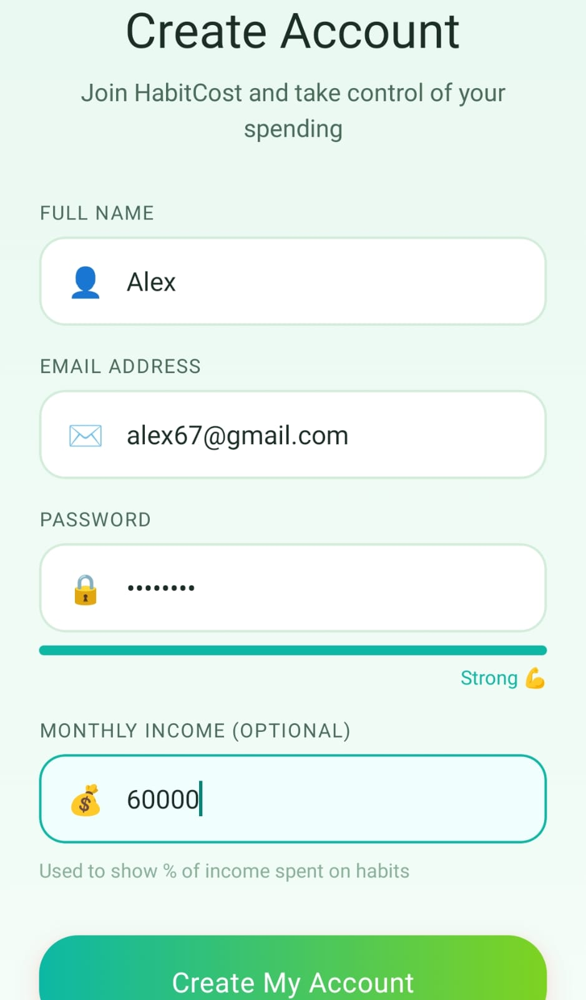
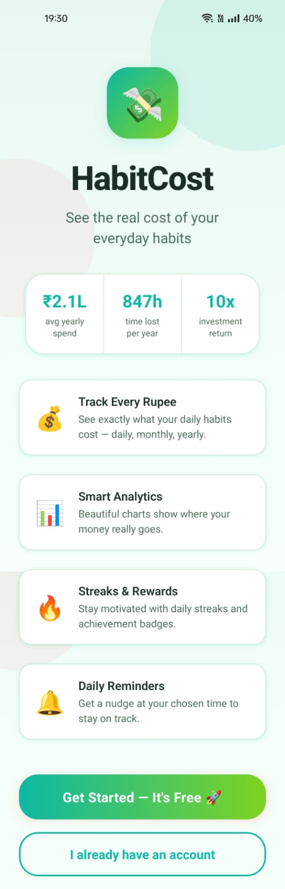
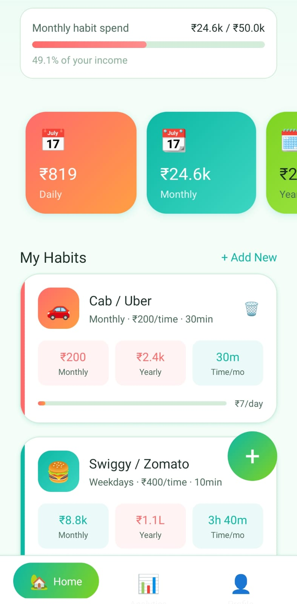
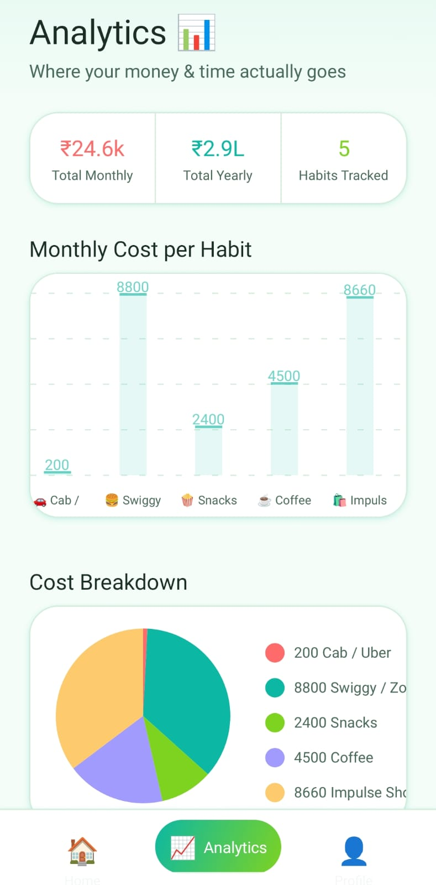
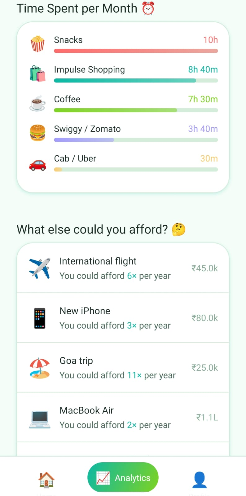
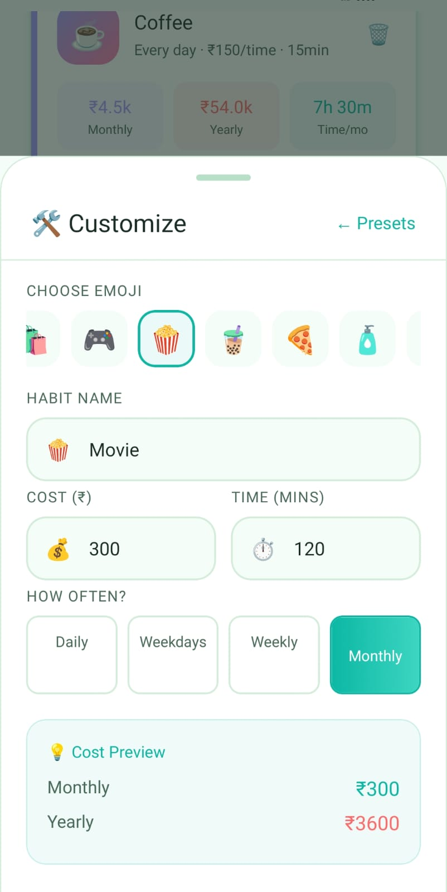
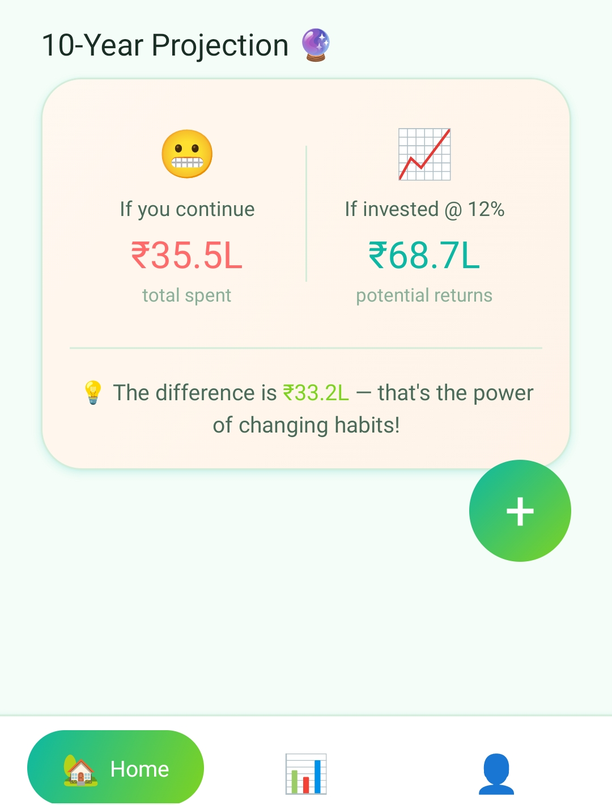

<div align="center">

# 💸 HabitCost

### Financial Awareness Through Habit Tracking

*A production-ready React Native mobile application that transforms daily habits into actionable financial insights*

[](https://reactnative.dev/)
[](https://expo.dev/)
[](LICENSE)
[]()

[Features](#-key-features) • [Architecture](#-architecture) • [Quick Start](#-quick-start) • [Screenshots](#-screenshots) • [Documentation](#-documentation)

</div>

---

## 📋 Table of Contents

- [Overview](#-overview)
- [Key Features](#-key-features)
- [Architecture](#-architecture)
- [Technology Stack](#-technology-stack)
- [Quick Start](#-quick-start)
- [Project Structure](#-project-structure)
- [Configuration](#-configuration)
- [Development](#-development)
- [Production Deployment](#-production-deployment)
- [API Integration](#-api-integration)
- [Screenshots](#-screenshots)
- [Contributing](#-contributing)
- [License](#-license)

---

## 🎯 Overview

HabitCost is an enterprise-grade mobile application designed to provide users with real-time financial awareness of their daily spending habits. By tracking recurring expenses and visualizing their long-term impact, the app empowers users to make informed financial decisions.

### Problem Statement

Micro-transactions and subscription services create "invisible spending" that accumulates significantly over time. Users lack awareness of how daily habits translate into annual costs and opportunity costs.

### Solution

HabitCost provides:
- **Real-time cost tracking** with frequency-based calculations
- **Visual analytics** through interactive charts and projections
- **Behavioral incentives** via streaks and achievement systems
- **Alternative recommendations** showing purchasing power of saved funds
- **10-year projections** comparing spending vs. compound investment returns

---

## ✨ Key Features

### 🔐 Authentication & Security
- **Local-first authentication** with AsyncStorage persistence
- **Password strength validation** with real-time feedback (Weak → Strong)
- **Session management** with secure token storage
- **Per-user data isolation** ensuring privacy
- **Production-ready architecture** supporting Firebase/Supabase integration

### 💰 Habit Management
- **12 preset habits** covering common expenses (Coffee, Transportation, Streaming, etc.)
- **Custom habit creation** with emoji selection
- **Flexible frequency options**: Daily, Weekdays, Weekly, Monthly
- **Automatic calculations**: Daily, monthly, yearly cost + time investment
- **Real-time updates** with optimistic UI patterns

### 📊 Advanced Analytics
- **Monthly cost distribution** via interactive bar charts
- **Category breakdown** through pie chart visualization
- **Time investment tracking** showing hours spent
- **Financial alternatives** displaying purchasing power equivalents
- **10-year projections** with compound investment comparison (8% annual return)
- **Export capabilities** for sharing insights

### 🔥 Gamification & Engagement
- **Daily login streaks** with milestone celebrations (7, 14, 30, 60, 100 days)
- **Achievement system** with 6 unlockable badges
- **Progress tracking** with visual feedback
- **Push notifications** for habit reminders and milestone celebrations
- **Customizable notification schedule** (default: 8 PM daily)

### 🎨 User Experience
- **Tropical design system** with custom gradient palette
- **Smooth animations** using React Native Animated API
- **Bottom sheet interactions** for habit creation
- **Custom tab navigation** with distinctive iconography
- **Offline-first architecture** ensuring uninterrupted usage
- **Responsive layouts** optimized for various screen sizes

---

## 🏗️ Architecture

### System Design

```
┌─────────────────────────────────────────────────────────────┐
│                    React Native Application                  │
├─────────────────────────────────────────────────────────────┤
│  Presentation Layer                                          │
│  ├─ Screens (Splash, Auth, Dashboard, Analytics, Profile)  │
│  ├─ Components (UI primitives, HabitCard, AddHabitSheet)   │
│  └─ Navigation (TabNavigator, Stack)                        │
├─────────────────────────────────────────────────────────────┤
│  Business Logic Layer                                        │
│  ├─ AuthContext (State management, CRUD operations)        │
│  ├─ Data utilities (calculations, formatters, validators)  │
│  └─ Achievement engine (Auto-evaluation logic)              │
├─────────────────────────────────────────────────────────────┤
│  Data Layer                                                  │
│  ├─ AsyncStorage (Offline persistence)                     │
│  ├─ Local session management                                │
│  └─ [Future: REST API integration]                          │
└─────────────────────────────────────────────────────────────┘
```

### State Management Flow

```
User Action → AuthContext Provider → Business Logic → AsyncStorage
                    ↓                                        ↓
              UI Re-render ← Context Update ← State Mutation
```

### Data Models

```typescript
User {
  id: string
  name: string
  email: string
  monthlyIncome: number
  joinDate: timestamp
  lastLogin: timestamp
  loginStreak: number
}

Habit {
  id: string
  userId: string
  name: string
  emoji: string
  cost: number
  frequency: 'daily' | 'weekdays' | 'weekly' | 'monthly'
  timeSpent: number
  category: string
  createdAt: timestamp
}

Achievement {
  id: string
  title: string
  description: string
  icon: string
  unlocked: boolean
  unlockedAt?: timestamp
  condition: (user, habits) => boolean
}
```

---

## 🛠️ Technology Stack

### Core Framework
| Technology | Version | Purpose |
|-----------|---------|---------|
| **React Native** | 0.74 | Cross-platform mobile development |
| **Expo SDK** | 51 | Managed workflow & native APIs |
| **React** | 18.2 | UI component framework |
| **React Navigation** | 6.x | Navigation & routing |

### State & Data Management
| Technology | Purpose |
|-----------|---------|
| **React Context API** | Global state management |
| **AsyncStorage** | Persistent offline storage |
| **Custom hooks** | Reusable state logic |

### UI & Visualization
| Library | Purpose |
|---------|---------|
| **react-native-chart-kit** | Data visualization (bar, pie, line charts) |
| **expo-linear-gradient** | Gradient backgrounds |
| **@expo-google-fonts/poppins** | Typography system |
| **React Native Animated API** | Smooth animations & transitions |

### Native Features
| Module | Purpose |
|--------|---------|
| **expo-notifications** | Push notifications & scheduling |
| **expo-font** | Custom font loading |
| **expo-splash-screen** | Splash screen management |
| **expo-status-bar** | Status bar customization |

### Development & Build Tools
| Tool | Purpose |
|------|---------|
| **EAS CLI** | Cloud builds & OTA updates |
| **Expo Go** | Development testing |
| **Metro Bundler** | JavaScript bundling |
| **Babel** | JavaScript transpilation |

---

## 🚀 Quick Start

### Prerequisites

Ensure you have the following installed:

- **Node.js** >= 18.0.0
- **npm** >= 9.0.0 or **yarn** >= 1.22.0
- **Expo CLI**: `npm install -g expo-cli`

**For iOS development:**
- macOS with Xcode 14+
- iOS Simulator

**For Android development:**
- Android Studio with SDK 33+
- Android Emulator or physical device

**Alternative (no setup required):**
- Expo Go app on iOS/Android device

### Installation

```bash
# Clone the repository
git clone https://github.com/yourusername/habitcost.git
cd habitcost

# Install dependencies
npm install

# Start the development server
npx expo start
```

### Running the App

**Option 1: Physical Device (Recommended)**
```bash
npx expo start
# Scan QR code with Expo Go app (iOS/Android)
```

**Option 2: iOS Simulator**
```bash
npx expo start
# Press 'i' to open iOS Simulator
```

**Option 3: Android Emulator**
```bash
npx expo start
# Press 'a' to open Android Emulator
```

### First-Time Setup

1. **Register a new account** with email and password
2. **Set monthly income** for percentage calculations
3. **Add habits** from presets or create custom ones
4. **View analytics** after adding 2+ habits

---

## 📁 Project Structure

```
habitcost/
│
├── App.jsx                          # Root component, navigation setup
├── app.json                         # Expo configuration
├── babel.config.js                  # Babel configuration
├── eas.json                         # EAS Build configuration
├── package.json                     # Dependencies & scripts
│
├── assets/                          # Static assets
│   ├── adaptive-icon.png           # Android adaptive icon
│   ├── icon.png                    # App icon (1024x1024)
│   ├── splash.png                  # Splash screen image
│   ├── notification-icon.png       # Notification icon
│   └── favicon.png                 # Web favicon
│
├── screens/                         # Screenshot assets for README
│   ├── login-page.jpeg
│   ├── home-page.jpeg
│   ├── dashboard.jpeg
│   ├── analytics.jpeg
│   ├── profile.jpeg
│   ├── customise.jpeg
│   └── 10year.jpeg
│
└── src/
    │
    ├── context/
    │   └── AuthContext.jsx         # Global state: auth, habits, achievements
    │
    ├── data/
    │   └── habits.js               # Preset habits, calculations, utilities
    │
    ├── navigation/
    │   └── TabNavigator.jsx        # Bottom tab navigation with custom styling
    │
    ├── screens/
    │   ├── SplashScreen.jsx        # Onboarding with feature highlights
    │   ├── RegisterScreen.jsx      # User registration with validation
    │   ├── LoginScreen.jsx         # User authentication
    │   ├── DashboardScreen.jsx     # Main dashboard with habits & stats
    │   ├── AnalyticsScreen.jsx     # Charts & financial insights
    │   └── ProfileScreen.jsx       # User profile, achievements, settings
    │
    └── components/
        ├── UI.jsx                  # Reusable UI components library
        ├── HabitCard.jsx           # Individual habit display card
        └── AddHabitSheet.jsx       # Bottom sheet for habit creation
```

### Key Files Explained

| File | Responsibility |
|------|---------------|
| `App.jsx` | Root component, loads fonts, initializes navigation |
| `AuthContext.jsx` | State management, CRUD operations, AsyncStorage |
| `habits.js` | Business logic for cost calculations & formatters |
| `TabNavigator.jsx` | Custom bottom navigation with tropical styling |
| `UI.jsx` | Design system primitives (Button, Card, Input, etc.) |

---

## ⚙️ Configuration

### Environment Variables

Create a `.env` file in the root directory:

```env
# API Configuration (for production backend)
EXPO_PUBLIC_API_URL=https://your-backend.onrender.com

# Notification Configuration
EXPO_PUBLIC_NOTIFICATION_TIME=20  # 24-hour format (default: 8 PM)

# Analytics (optional)
EXPO_PUBLIC_ANALYTICS_ID=your-analytics-id
```

### App Configuration (`app.json`)

```json
{
  "expo": {
    "name": "HabitCost",
    "slug": "habitcost",
    "version": "1.0.0",
    "icon": "./assets/icon.png",
    "splash": {
      "image": "./assets/splash.png",
      "resizeMode": "contain",
      "backgroundColor": "#0F172A"
    },
    "ios": {
      "bundleIdentifier": "com.yourcompany.habitcost",
      "supportsTablet": true
    },
    "android": {
      "package": "com.yourcompany.habitcost",
      "adaptiveIcon": {
        "foregroundImage": "./assets/adaptive-icon.png",
        "backgroundColor": "#0F172A"
      },
      "permissions": [
        "NOTIFICATIONS",
        "VIBRATE"
      ]
    },
    "notification": {
      "icon": "./assets/notification-icon.png",
      "color": "#10B981"
    }
  }
}
```

---

## 💻 Development

### Available Scripts

```bash
# Start development server
npm start

# Start with cache cleared
npm run start:clear

# Run on iOS simulator
npm run ios

# Run on Android emulator
npm run android

# Run tests (if configured)
npm test

# Lint code
npm run lint

# Format code
npm run format
```

### Development Workflow

1. **Feature Development**
   - Create feature branch: `git checkout -b feature/your-feature`
   - Make changes with hot reload enabled
   - Test on both iOS and Android

2. **State Management**
   - Use `useAuth()` hook to access global state
   - All habit operations go through AuthContext
   - AsyncStorage automatically syncs on state changes

3. **Adding New Screens**
   - Create screen in `src/screens/`
   - Add to navigation in `App.jsx`
   - Update TabNavigator if it's a tab screen

4. **Adding New Components**
   - Add to `src/components/UI.jsx` if reusable
   - Keep component-specific logic in dedicated files
   - Use TypeScript-style JSDoc for props documentation

### Code Style Guidelines

```javascript
// Use functional components with hooks
const MyComponent = ({ prop1, prop2 }) => {
  const [state, setState] = useState(initialValue);
  
  useEffect(() => {
    // Side effects here
  }, [dependencies]);
  
  return <View>...</View>;
};

// Context usage
const { user, habits, addHabit } = useAuth();

// Async operations with error handling
const handleSubmit = async () => {
  try {
    await addHabit(habitData);
    Alert.alert('Success', 'Habit added!');
  } catch (error) {
    Alert.alert('Error', error.message);
  }
};
```

### Debugging

**React Native Debugger**
```bash
# Install
brew install --cask react-native-debugger

# Start app with debugger
npm start
# Press 'j' in terminal to open debugger
```

**Console Logs**
```javascript
console.log('Debug:', variable);  // Appears in Metro bundler terminal
```

**AsyncStorage Inspector**
```javascript
import AsyncStorage from '@react-native-async-storage/async-storage';

// View all stored data
AsyncStorage.getAllKeys().then(keys => 
  AsyncStorage.multiGet(keys).then(stores => console.log(stores))
);
```

---

## 🚢 Production Deployment

### Building with EAS (Expo Application Services)

#### 1. Setup EAS CLI

```bash
# Install EAS CLI globally
npm install -g eas-cli

# Login to Expo account
eas login

# Configure your project
eas build:configure
```

#### 2. Android Build

```bash
# Build APK (for testing)
eas build --platform android --profile preview

# Build AAB (for Google Play Store)
eas build --platform android --profile production
```

**Google Play Store Submission:**
1. Download `.aab` file from build dashboard
2. Create app listing in Google Play Console
3. Upload AAB to Internal Testing track
4. Complete store listing (screenshots, description, privacy policy)
5. Submit for review

#### 3. iOS Build

```bash
# Build for TestFlight/App Store
eas build --platform ios --profile production
```

**App Store Submission:**
1. Ensure Apple Developer Program membership ($99/year)
2. Create App Store Connect listing
3. Upload build via EAS or Xcode
4. Complete metadata and screenshots
5. Submit for App Review

#### 4. Over-The-Air (OTA) Updates

For bug fixes and minor updates without app store review:

```bash
# Create update branch
eas update --branch production --message "Fixed analytics bug"

# Users automatically receive update on next app launch
```

### Build Profiles (`eas.json`)

```json
{
  "build": {
    "development": {
      "developmentClient": true,
      "distribution": "internal"
    },
    "preview": {
      "distribution": "internal",
      "android": {
        "buildType": "apk"
      }
    },
    "production": {
      "android": {
        "buildType": "aab"
      },
      "ios": {
        "autoIncrement": "buildNumber"
      }
    }
  }
}
```

### Pre-Deployment Checklist

- [ ] Update version in `app.json`
- [ ] Test on physical iOS device
- [ ] Test on physical Android device
- [ ] Verify all animations are smooth (60 FPS)
- [ ] Test offline functionality
- [ ] Test notification permissions
- [ ] Update privacy policy if needed
- [ ] Prepare store assets (screenshots, description, keywords)
- [ ] Configure analytics tracking
- [ ] Set up crash reporting (e.g., Sentry)

---

## 🔌 API Integration

### Current Architecture (Offline-First)

The app currently uses **AsyncStorage** for local persistence. All data is stored on-device.

### Migration to Backend

To connect to a REST API (FastAPI, Node.js, Django, etc.):

#### 1. Create API Client (`src/utils/api.js`)

```javascript
import axios from 'axios';
import AsyncStorage from '@react-native-async-storage/async-storage';

const api = axios.create({
  baseURL: process.env.EXPO_PUBLIC_API_URL,
  timeout: 10000,
  headers: {
    'Content-Type': 'application/json',
  }
});

// Request interceptor: Attach JWT token
api.interceptors.request.use(
  async (config) => {
    const token = await AsyncStorage.getItem('@token');
    if (token) {
      config.headers.Authorization = `Bearer ${token}`;
    }
    return config;
  },
  (error) => Promise.reject(error)
);

// Response interceptor: Handle 401 errors
api.interceptors.response.use(
  (response) => response,
  async (error) => {
    if (error.response?.status === 401) {
      await AsyncStorage.removeItem('@token');
      // Navigate to login screen
    }
    return Promise.reject(error);
  }
);

export default api;
```

#### 2. Update AuthContext Methods

```javascript
import api from '../utils/api';

// Register
const register = async (name, email, password, monthlyIncome) => {
  try {
    const response = await api.post('/api/auth/register', {
      name,
      email,
      password,
      monthlyIncome
    });
    
    const { token, user } = response.data;
    await AsyncStorage.setItem('@token', token);
    setUser(user);
  } catch (error) {
    throw new Error(error.response?.data?.message || 'Registration failed');
  }
};

// Login
const login = async (email, password) => {
  try {
    const response = await api.post('/api/auth/login', { email, password });
    const { token, user } = response.data;
    
    await AsyncStorage.setItem('@token', token);
    setUser(user);
    
    // Fetch user's habits
    const habitsRes = await api.get('/api/habits');
    setHabits(habitsRes.data);
  } catch (error) {
    throw new Error(error.response?.data?.message || 'Login failed');
  }
};

// Add Habit
const addHabit = async (habit) => {
  try {
    const response = await api.post('/api/habits', habit);
    setHabits(prev => [...prev, response.data]);
  } catch (error) {
    throw new Error('Failed to add habit');
  }
};

// Delete Habit
const deleteHabit = async (habitId) => {
  try {
    await api.delete(`/api/habits/${habitId}`);
    setHabits(prev => prev.filter(h => h.id !== habitId));
  } catch (error) {
    throw new Error('Failed to delete habit');
  }
};
```

#### 3. Backend API Endpoints

Your backend should implement these endpoints:

```
POST   /api/auth/register          # Create new user
POST   /api/auth/login             # Authenticate user
GET    /api/auth/me                # Get current user
PUT    /api/auth/profile           # Update profile

GET    /api/habits                 # Get user's habits
POST   /api/habits                 # Create habit
PUT    /api/habits/:id             # Update habit
DELETE /api/habits/:id             # Delete habit

GET    /api/achievements           # Get user's achievements
POST   /api/achievements/:id/unlock # Unlock achievement

GET    /api/analytics              # Get aggregated analytics
```

#### 4. Example FastAPI Backend

```python
from fastapi import FastAPI, Depends, HTTPException
from fastapi.security import HTTPBearer, HTTPAuthorizationCredentials
from pydantic import BaseModel
from typing import List
import jwt

app = FastAPI()
security = HTTPBearer()

class HabitCreate(BaseModel):
    name: str
    emoji: str
    cost: float
    frequency: str
    timeSpent: int
    category: str

@app.post("/api/habits")
async def create_habit(
    habit: HabitCreate,
    credentials: HTTPAuthorizationCredentials = Depends(security)
):
    user_id = verify_token(credentials.credentials)
    new_habit = db.create_habit(user_id, habit.dict())
    return new_habit

@app.get("/api/habits")
async def get_habits(
    credentials: HTTPAuthorizationCredentials = Depends(security)
):
    user_id = verify_token(credentials.credentials)
    habits = db.get_user_habits(user_id)
    return habits
```

### Hybrid Approach (Recommended)

For optimal UX, use a hybrid approach:

1. **Write operations**: Send to backend immediately
2. **Read operations**: Read from local cache first
3. **Background sync**: Periodically sync with server
4. **Offline queue**: Queue operations when offline, sync when online

```javascript
const addHabit = async (habit) => {
  // Optimistic update (instant UI feedback)
  const tempId = `temp-${Date.now()}`;
  const optimisticHabit = { ...habit, id: tempId };
  setHabits(prev => [...prev, optimisticHabit]);
  
  try {
    // Send to backend
    const response = await api.post('/api/habits', habit);
    
    // Replace temp with real data
    setHabits(prev => 
      prev.map(h => h.id === tempId ? response.data : h)
    );
  } catch (error) {
    // Revert on failure
    setHabits(prev => prev.filter(h => h.id !== tempId));
    throw error;
  }
};
```

---

## 📸 Screenshots

<div align="center">

### Authentication Flow


### Dashboard & Analytics




### Profile & Customization



### Financial Projections


</div>

---

## 🤝 Contributing

We welcome contributions! Please follow these guidelines:

### Development Process

1. **Fork the repository**
2. **Create a feature branch**: `git checkout -b feature/amazing-feature`
3. **Make your changes** following code style guidelines
4. **Test thoroughly** on both iOS and Android
5. **Commit with clear messages**: `git commit -m 'Add amazing feature'`
6. **Push to your branch**: `git push origin feature/amazing-feature`
7. **Open a Pull Request** with detailed description

### Code Review Criteria

- [ ] Follows existing code style and patterns
- [ ] Includes proper error handling
- [ ] Tested on iOS and Android
- [ ] No console warnings or errors
- [ ] Updates documentation if needed
- [ ] Maintains offline-first functionality

### Reporting Bugs

Use the GitHub issue tracker. Include:
- Device and OS version
- Steps to reproduce
- Expected vs actual behavior
- Screenshots or video if applicable
- Console logs

---

## 📚 Documentation

### Additional Resources

- [Expo Documentation](https://docs.expo.dev/)
- [React Native Documentation](https://reactnative.dev/docs/getting-started)
- [React Navigation Guide](https://reactnavigation.org/docs/getting-started)
- [AsyncStorage API](https://react-native-async-storage.github.io/async-storage/)

### Key Concepts

**Habit Cost Calculations**
```javascript
// Located in src/data/habits.js
function getMonthlyCost(cost, frequency) {
  switch (frequency) {
    case 'daily': return cost * 30;
    case 'weekdays': return cost * 22;
    case 'weekly': return cost * 4;
    case 'monthly': return cost;
  }
}
```

**Achievement Evaluation**
```javascript
// Runs on every render in ProfileScreen
achievements.forEach(achievement => {
  if (!achievement.unlocked && achievement.condition(user, habits)) {
    unlockAchievement(achievement.id);
  }
});
```

**Notification Scheduling**
```javascript
// Daily reminder at 8 PM
await Notifications.scheduleNotificationAsync({
  content: {
    title: "Track Your Habits! 🔥",
    body: `You're on a ${user.loginStreak}-day streak!`,
  },
  trigger: { hour: 20, minute: 0, repeats: true }
});
```

---

## 🔒 Security Considerations

- **Password Storage**: Never stored in plain text (hashed with bcrypt on backend)
- **Token Management**: JWT tokens stored securely in AsyncStorage
- **API Communication**: Use HTTPS in production
- **Input Validation**: All user inputs validated before processing
- **Rate Limiting**: Implement on backend to prevent abuse
- **Sensitive Data**: Never log passwords or tokens

---

## 🐛 Known Issues & Limitations

- **Offline Analytics**: Charts require at least 2 habits to render
- **Notification Permissions**: Must be granted by user manually
- **Large Datasets**: Performance may degrade with 50+ habits (use pagination in future)
- **Time Zone**: All times are in device's local time zone

---

## 🗺️ Roadmap

### Version 1.1
- [ ] Cloud sync with backend API
- [ ] Export data as CSV/PDF
- [ ] Dark mode support
- [ ] Widget for iOS/Android home screen

### Version 1.2
- [ ] Social features (share achievements)
- [ ] Budget recommendations based on spending
- [ ] Machine learning predictions
- [ ] Multi-currency support

### Version 2.0
- [ ] Web dashboard (React.js)
- [ ] Family/group tracking
- [ ] Smart notifications based on patterns
- [ ] Integration with banking APIs

---

## 📄 License

This project is licensed under the **MIT License**.

```
MIT License

Copyright (c) 2024 HabitCost

Permission is hereby granted, free of charge, to any person obtaining a copy
of this software and associated documentation files (the "Software"), to deal
in the Software without restriction, including without limitation the rights
to use, copy, modify, merge, publish, distribute, sublicense, and/or sell
copies of the Software, and to permit persons to whom the Software is
furnished to do so, subject to the following conditions:

The above copyright notice and this permission notice shall be included in all
copies or substantial portions of the Software.

THE SOFTWARE IS PROVIDED "AS IS", WITHOUT WARRANTY OF ANY KIND, EXPRESS OR
IMPLIED, INCLUDING BUT NOT LIMITED TO THE WARRANTIES OF MERCHANTABILITY,
FITNESS FOR A PARTICULAR PURPOSE AND NONINFRINGEMENT. IN NO EVENT SHALL THE
AUTHORS OR COPYRIGHT HOLDERS BE LIABLE FOR ANY CLAIM, DAMAGES OR OTHER
LIABILITY, WHETHER IN AN ACTION OF CONTRACT, TORT OR OTHERWISE, ARISING FROM,
OUT OF OR IN CONNECTION WITH THE SOFTWARE OR THE USE OR OTHER DEALINGS IN THE
SOFTWARE.
```

---

<div align="center">

**Built with ❤️ using React Native & Expo**

⭐ Star this repo if you found it helpful!

[Report Bug](https://github.com/yourusername/habitcost/issues) • [Request Feature](https://github.com/yourusername/habitcost/issues) • [Documentation](https://docs.habitcost.app)

</div>
